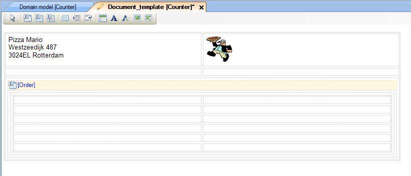
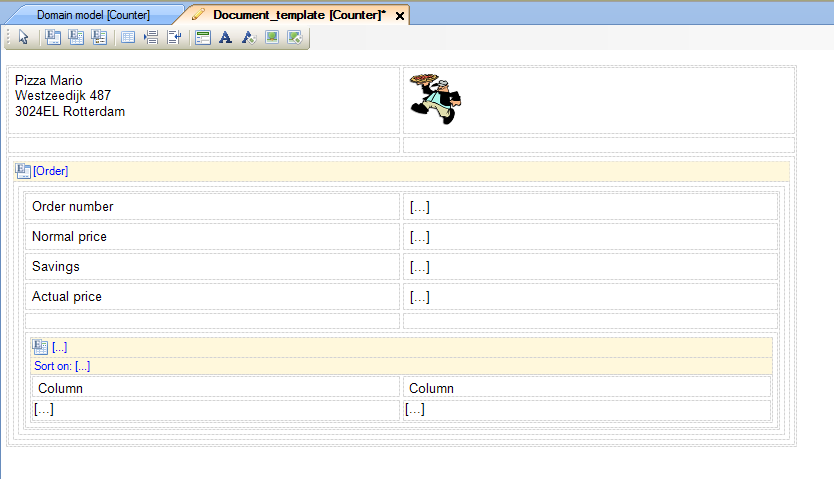
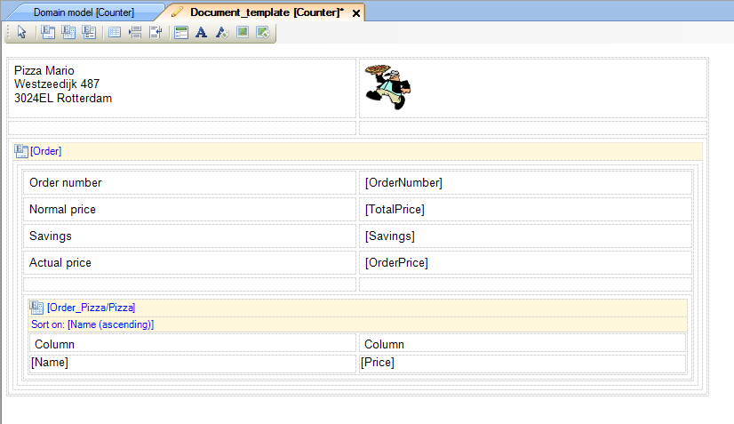
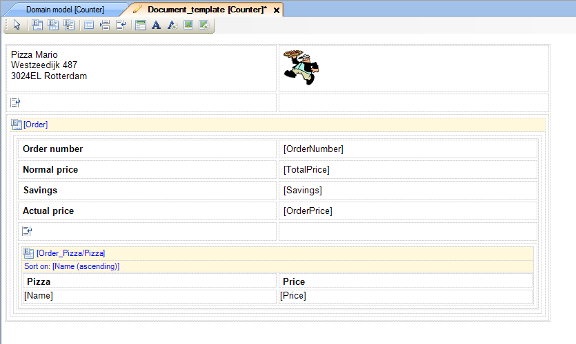

## Description

This section describes how to create and build a basic document template. (Using the example of a document with order details) The related reference guide article can be found [here](https://world.mendix.com/pages/releaseview.action?pageId=9208532).

## Instructions

 **If it does not exist yet, create the document template. If you do not know how to add documents to your project, please refer to [this](https://world.mendix.com/display/howto25/Add+documents+to+a+module) How To.**

 **Double-click on the document template in the Project Explorer to open it.**

 **If necessary you can edit properties such as page size, margins and pixels per inch for pictures in the Properties window.**

 **Build your document template from the available widgets.**

## Template building example: Pizza Mario order sheet

 **The first step in building this document template is to add a table which can contain the content widgets that are going to be used. For this example, a 3x2 table is needed. To get this, click on the Table widget in the toolbar, hold the mouse button and drag it onto the document template.**

 **Fill the table cells with widgets. For the top left corner a static label widget for the name and address of the fictional Pizza Mario firm is used. For the top right corner a static image viewer for the Pizza Mario logo is used. The bottom two cells have to be merged by right-clicking in the bottom left cell and choosing 'Merge with right'. Afterwards, the cell is filled by a data view.**

 **The static label is filled by clicking on the '...' button next to 'Caption' in the property window, and entering the address information in the pop up window. The logo is added by clicking on the '...' button next to 'Image' in the Properties window. (The logo was added to the project as custom image before building the template) Finally the data view is connected to the 'Order' entity by selecting the data view, and then clicking on 'Order' in the Connector menu and dragging it towards the yellow header field of the data view.**

 **A 6x2 table is added to the data view to create room for content widgets to be added. For first four rows the left column gets a static label, whereas the right column gets dynamic labels to display the actual information. The bottom row is merged, and a data grid is added here.**

 **The dynamic labels are connected to the attributes of the 'Order' object by clicking on them and then dragging the attributes from the Connector menu to their respective dynamic labels. The data grid is added to list the pizzas which were ordered. To achieve this, the data grid is connected to the 'Pizza' entity, with the associated Pizza objects being retrieved through the 'Order_Pizza' association. Finally, similarly to the dynamic labels, the attributes of 'Pizza' are dragged from the connector to their respective columns and the list is set to sort on the 'Name' attribute of 'Pizza'.**

 **The last few steps will improve the layout and looks of the document template. First, page breaks are added to the empty rows in both the original table and the table in the data view, so that the information remains easy to read. Also, the column headers are changed to reflect the contents by changing their 'Caption' property in the Properties window. Finally, the 'Header style' attribute of the static captions in the data view and the column headers is altered to bold them. This is done by pressing the '...' button next to 'Header style' in the Properties window, placing a check mark next to 'Weight' in the new menu and then selecting 'Bold'.**

 **When ordering the client to generate a document based on this template, the generated document will look like the one in the picture below.**

To find out how to use the created document template to generate a document with a microflow, please refer to [this](https://world.mendix.com/display/howto25/Generate+documents+from+document+templates) article.

[(Back to Top)](Create+and+build+a+document+template)