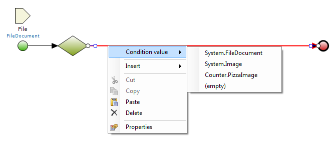
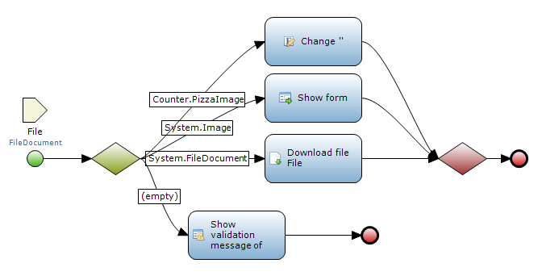

## Description

This section describes how to use an inheritance split to use a specialization of an entity. The related reference guide article can be found [here](https://world.mendix.com/pages/releaseview.action?pageId=10420541).

## Instructions

 **Open the microflow, or if necessary create a new one. If you do not know how to add documents to your project, please refer to [this](https://world.mendix.com/display/howto25/Add+documents+to+a+module) article.**

 **Add an 'Inheritance split' to the microflow and double click on it. If you do not know how to do this, please refer to [this](https://world.mendix.com/display/howto25/Add+an+activity+to+a+microflow) article.**

 **Use the drop down menu to choose the variable which is to be inspected for the inheritance split.**

 **After configuring the inheritance split, you will notice that the sequence flow paths leading out of it have turned red. Right-click on such a path and then under 'Condition value' choose the specialization for which this path should be executed.**

 **Create additional paths for every specialization. Add activities and, if necessary, end events to these paths to finish the microflow.**

