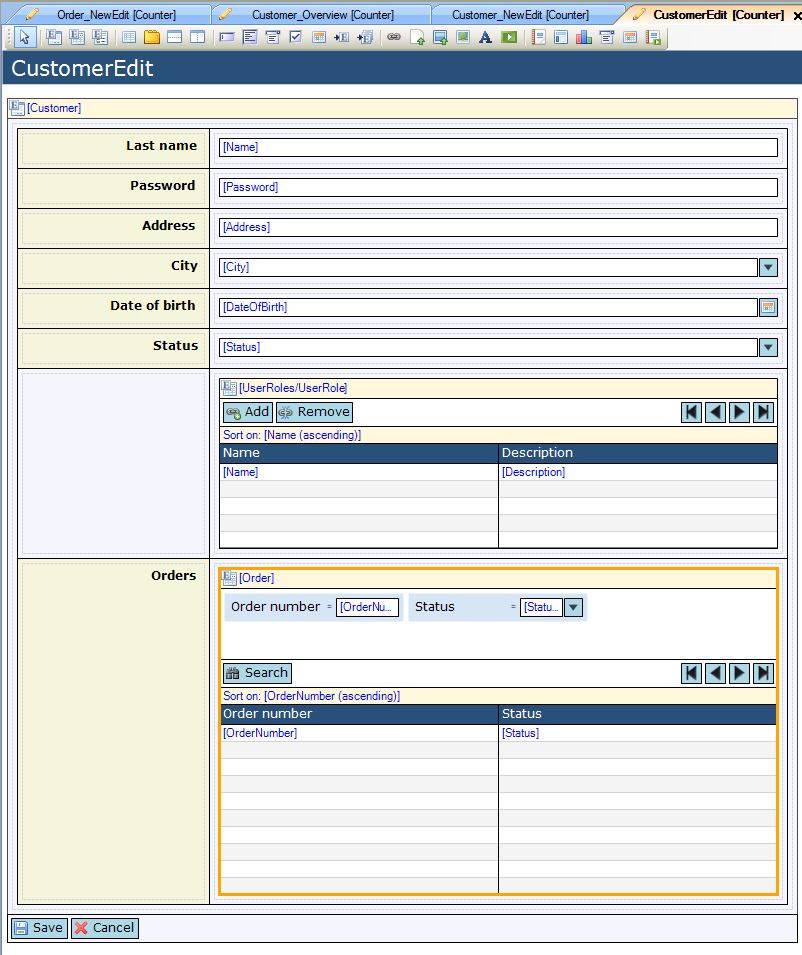
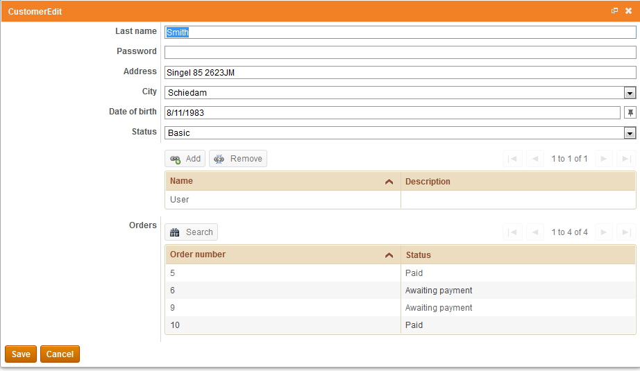
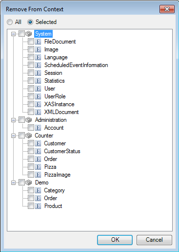

## Description

This section describes how to use the 'Apply context' property to constrain the objects displayed in a data or template grid. The related reference guide article can be found [here](https://world.mendix.com/pages/releaseview.action?pageId=9208573).

## Instructions

 **Create the forms for your application, and open the form you want to use the 'Apply context' functionality on.**

 **Select the data grid or template grid you want to apply context on.**

 **Use the drop-down menu next to 'Apply context' to set this property to 'True'.**

In the above screenshot the selected data grid is connected to the 'Order' entity, without the use of an entity path to the data view entity 'Customer'. Normally this would mean all 'Order' objects would be shown in the data grid, but due to setting 'Apply context' to true, only the orders made by the customer from the enveloping data view are shown.

 **On the other hand you can use the 'Remove from context' by clicking on the '...' button next to it in the Properties window to remove objects from the context, to avoid template or data grids from being constrained based on previous selections.**

In the menu that appears, you can select the entities that should be removed from the context.

