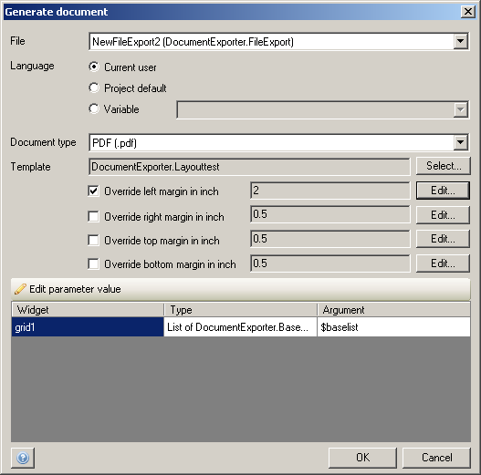

With the import-XML action you can import the data stored in a XML document into [domain model](Domain+Model) entities.



Generate document



## Input Properties

### XML document

The XML document that will be imported. This should be an object of entity 'System.FileDocument' or a specialization thereof.

## Action Properties

### XML-to-domain mapping

The [XML-to-domain mapping](XML+to+Domain+Mappings) defines how to transform the XML document to objects.

### Parameter

If the selected mapping requires a parameter, you can choose it here.

### Range (if the mapping returns a list)

The range determines how many objects are mapped and returned.

| Range | Meaning |
| --- | --- |
| All | Map and return all objects. |
| First | Map and return only the first object. The result of the action will be a single object instead of a list. |
| Custom | Map and return a given number of objects (limit). The limit is a microflow expression that should result in a number. |

## Output Properties

### Store in variable

Choose whether to store the result of the import in a variable.

### Name

The name for the variable that will hold the result of the import.

## Related Articles

*   [How To: Import XML documents](https://world.mendix.com/display/howto25/Import+XML+documents)