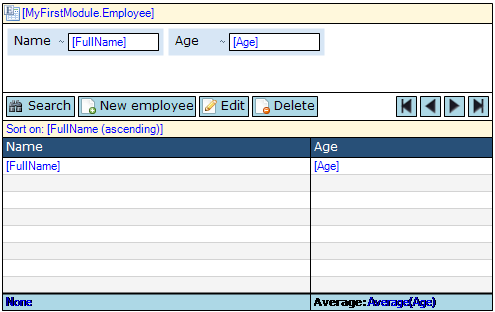
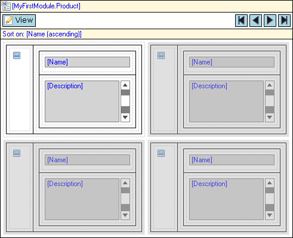
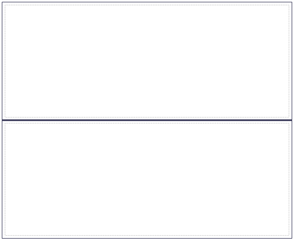
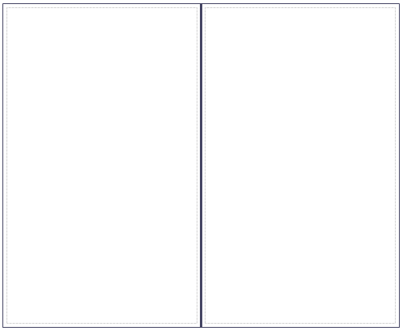
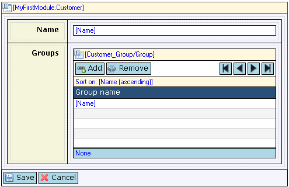
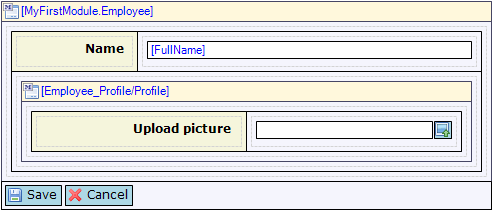



This document describes what web forms are for and what kind of widgets can be placed on them. If you want to see the properties of the web form you can check the documentation for a [Web Form](Web+Form) itself.



Web Forms are used to create a user interface for the end user. They are composed of components that are called _widgets_. Below is a categorized overview of all the widgets. The following categories are used:

*   [Core widgets](Web+Forms) are central to building forms in Mendix. They are the widgets that can show a list of entities or a single entity.
*   [Layout widgets](Web+Forms) are used to structure the layout of your forms.
*   [Input widgets](Web+Forms) make it possible to show and edit the values of attributes and associations.
*   [Other widgets](Web+Forms) allow you to work with images, files and to create buttons and labels.
*   [Custom widgets](Web+Forms) can be downloaded from the Mendix Appstore or created by yourself.

## Core widgets

The core widgets are central to building forms in Mendix. They can show the contents of a single entity or of a list of entities. Every form that wants to show data from the domain model needs one of these components.

### Data Grid

The data grid shows a list of objects in a grid. For example, a data grid can show all the orders a customer has placed. Using controls provided by the data grid you can browse, search and edit those objects.

See [Data Grid](Data+Grid).



A data grid showing name and age of employees.



### Data view

The data view is a central component in Mendix applications. It is the starting point for showing the contents of exactly one object. If, for example, you want to show details of a single customer you would use a data view to do this. The data view typically contains a table with labels and input widgets like text boxes. In more complex screens, a data view can contain tab controls per topic (address, payment information) and data views and data grids for related objects (order history, wish list).

See [Data View](Data+View).



A data view show customer information.



### Template grid

The template grid shows a list of objects in a tile view. For example, a template grid can show a list of products. Using controls provided by the template grid you can browse, search and manipulate those objects. The template grid has a lot in common with the data grid. The main difference is that the objects are shown in templates (a sort of small data view) instead of rows.

See [Template Grid](Template+Grid).



A template grid showing products with name, description and image.



## Layout widgets

Layout widgets give structure to a form. They do not manipulate data but provide a layout in which you can place other widgets that do.

### Table

Tables can be used to change the layout of the form. They contain a number of rows and columns and the intersection of the two is called a cell. Each cell can contain widgets again. Cells can be merged horizontally and vertically to allow for asymmetric layouts.

See [Table](Table).



A table with three rows and four columns.



### Tab control

Tab controls are used to show information categorized in multiple tab pages. This can be very useful if the amount of information that has to be displayed is larger than the amount of space on the screen.

See [Tab Control](Tab+Control).



A tab control with tab pages 'Address' and 'Orders'.



### Horizontal split pane

A horizontal split pane creates a region that is split in two by a horizontal divider. In the client the divider can be moved up and down by the end user.

See [Horizontal Split Pane](Horizontal+Split+Pane).



An empty horizontal pane. Both panes can contain other widgets.



### Vertical split pane

A vertical split pane creates a region that is split in two by a vertical divider. In the client the divider can be moved to the left and to the right by the end user.

See [Vertical Split Pane](Vertical+Split+Pane).



An empty vertical pane. Both panes can contain other widgets.



## Input widgets

Input widgets are used for showing and entering data. They must be placed inside a data view because they show attributes or associations of an entity.

### Check box

A check box shows a box that is either ticked or empty. You can use it to display and/or edit a truth value.

See [Check Box](Check+Box).



A check box for choosing whether or not to send e-mail.



### Date picker

A date picker can be used to display and/or edit a date value.

See [Date Picker](Date+Picker).



A date picker for selecting a birth date.



### Drop-down widget

A drop-down widget can be used to display and/or select an enumeration value.

See [Drop-Down Widget](Drop+Down+Widget).



A drop-down widget for selecting a state.



### Reference selector

The reference selector allows you to set an association of type reference by selecting an object. For example, in an order form you might be able to select the customer to whom the order applies. The reference selector shows an attribute of the associated entity, for example, the name of the customer.

See [Reference Selector](Reference+Selector).



A reference selector for selector the customer of an order.



### Reference set selector

The reference set selector allows you to set an association of type reference set by selecting objects. For example, if customers can belong to several groups, a reference set selector can be used to select the groups the customer belongs to. This requires that there is an association from customer to group of type reference set in the domain model.

See [Reference Set Selector](Reference+Set+Selector).



A reference set selector for managing the groups of a customer.



### Text area

A text area can be used to display and/or edit a long text value that can be split over several lines.

See [Text Area](Text+Area).



A text area for entering a long description.



### Text box

A text box can be used to display and/or edit a textual value. For long texts with multiple lines, use a text area instead.

See [Text Box](Text+Box).



A text box for entering a name.



## Other widgets

These other widgets allow you to manipulate images and files, place labels in table cells and provide buttons and links to click.

### External link

An external link can be used to display a clickable link that redirects to a given URL.

See [External Link](External+Link).



An external link for jumping to the Mendix web site.



### File manager

A file manager is used to upload and/or download files.

See [File Manager](File+Manager).



A file manager for uploading and downloading a file.



### Image uploader

An image uploader is used to upload images to the server. It also generates a thumbnail of the uploaded image. The uploaded image or its thumbnail can be shown by use of the image viewer.

See [Image Uploader](Image+Uploader).



An image uploader to upload a profile picture for an employee.



### Image viewer

An image viewer can be used to display an image or its thumbnail.

See [Image Viewer](Image+Viewer).



An image viewer showing a product picture.



### Label

A label shows a line of static text. You can use it to place custom text on your form.

See [Label](Label).



A label with caption 'Name'.



### Microflow trigger

A microflow trigger can be used to create a button or link that starts a microflow on a form.

See [Microflow Trigger](Microflow+Trigger).



A microflow trigger to retrieve the address corresponding to a zip code.



## Custom Widgets

If the project directory of your project has a widget directory with custom widgets, these custom widgets are available in the form editor.





For more information, see the [tutorials](https://world.mendix.com/display/Tutorials/Custom+Widgets) for custom widgets.



Custom widgets that require the context of an entity should be inserted in a data view or template grid.



## Related Articles

*   [How To: Add a widget to a form](https://world.mendix.com/display/howto40/Add+a+widget+to+a+form)
*   [How To: Create and build a form](https://world.mendix.com/display/howto40/Create+and+build+a+form)
*   [How To: Apply XPath within the form builder](https://world.mendix.com/display/howto40/Apply+XPath+within+the+form+builder)